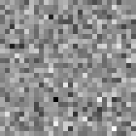

# Generative Machine Learning

This repository showcases two of the most relevant generative models (built in pytorch) as of July 2023, generative Adversarial Networks (GANs) and Diffusion models, for the generation of Simpsons faces and MNIST numbers.

## GAN

  
  

  

## Difussion model

  

## Credits

* [m4mbo](https://github.com/m4mbo) - Code
* [LMH](https://www.lmh.ox.ac.uk/) summer program on 'AI and ML: Advanced Applications' - Theory

  

